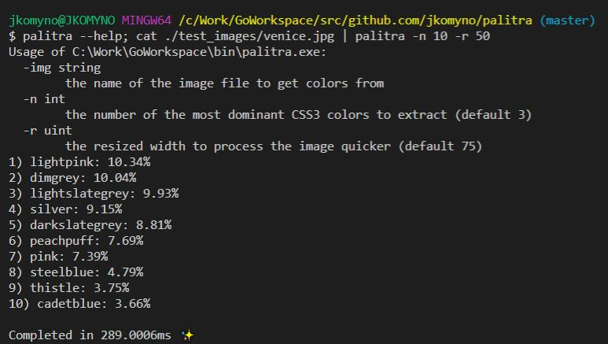

# palitra

[](https://travis-ci.org/jkomyno/palitra) [](https://godoc.org/github.com/jkomyno/palitra) [](https://goreportcard.com/report/github.com/jkomyno/palitra)



# Description
A fast utility to find the N most frequent colors in a picture, approximated to CSS3 color names.
Palitra is available both as a plain library, and as a CLI tool (which also supports input from `stdin`, via pipe).
**It requires Go 1.8**.

## Install

You can download the library with `go get`:

```bash
$ go get github.com/jkomyno/palitra
```

If you want to use the CLI tool, then you can type the following to install it in your environment.

```bash
$ go install github.com/jkomyno/palitra/cmd/palitra
```

## Usage

### CLI

This guide assumes that `palitra` is installed globally.

Here's how `palitra --help` looks like:

```bash
Usage of C:\Work\GoWorkspace\bin\palitra.exe:
  -img string
        the name of the image file to get colors from
  -n int
        the number of the most dominant CSS3 colors to extract (default 3)
  -r uint
        the resized width to process the image quicker (default 75)
```

If you're ok with the default values, then you can simply pipe an image to palitra. Example:

```bash
$ cat ./test_images/venice.jpg | palitra
```

The result should look like the following:
```bash
1) lightpink: 10.48%
2) lightslategrey: 9.97%
3) dimgrey: 9.61%

Completed in 679.7955ms ✨
```

If not, you can manually specify the parameters as you like:

```bash
$ palitra -img ./test_images/venice.jpg -n 5 -r 50
```

The result should look like the following:
```bash
1) lightpink: 10.34%
2) dimgrey: 10.04%
3) lightslategrey: 9.93%
4) silver: 9.15%
5) darkslategrey: 8.81%

Completed in 290.7805ms ✨
```

### Library

For the library usage, please refer to [godoc](https://godoc.org/github.com/jkomyno/palitra).
You can import the library in the following way:

```go
import "github.com/jkomyno/palitra"
```

## Testing

``` bash
$ go test -v -bench=.
```

## License

The MIT License (MIT). Please see [License File](LICENSE.md) for more information.